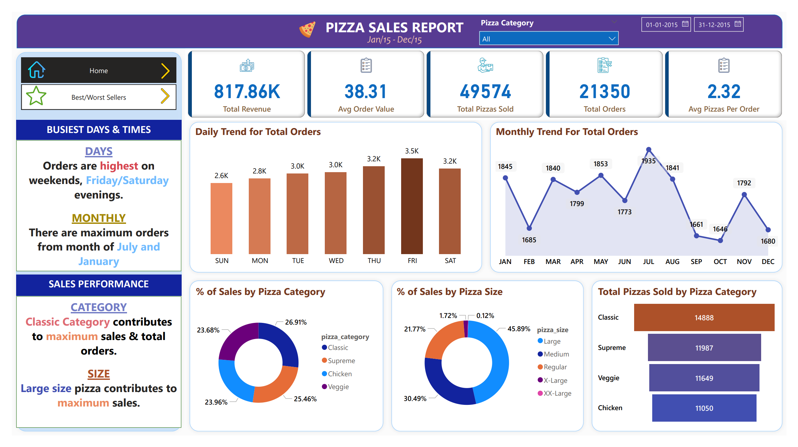
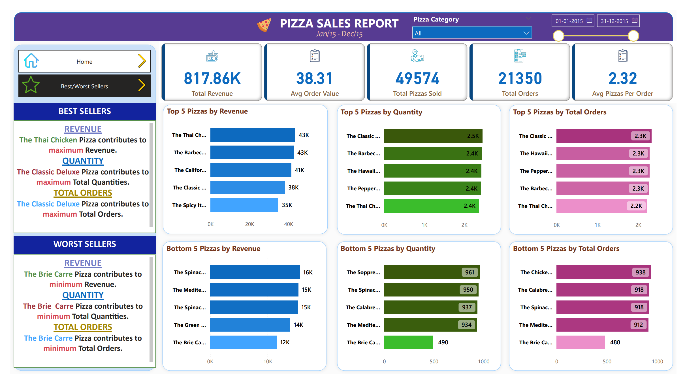
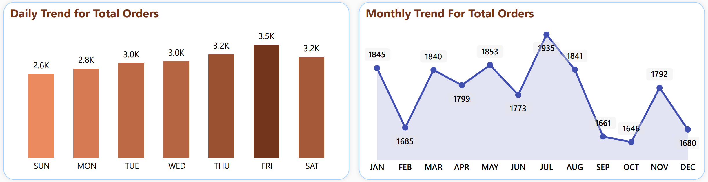
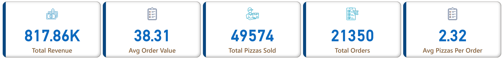

# 🍕 Pizza Sales Analysis Dashboard using Power BI & SQL

## Project Overview

This project is an end-to-end analysis of pizza sales data for the year 2015 using **MS SQL Server** and **Power BI**. The goal is to create an insightful dashboard that helps the client understand pizza sales trends, customer preferences, and identify both best and worst-selling products. The dataset contains approximately 48,000 rows of pizza sales data including order details, pizza sizes, categories, ingredients, and more.

### Key Features
- **MS SQL Server** is used to import, clean, and analyze raw data.
- **Power BI** connects to the SQL database, processes data, and visualizes insights with interactive dashboards.
- Dynamic dashboards help in exploring KPIs, sales trends, best-selling, and worst-selling pizzas.
  
---

## Problem Statement

The client requires a dashboard that allows for a deeper understanding of pizza sales and helps in making business decisions by identifying key performance indicators (KPIs) and visualizing sales data.

### KPIs:
1. **Total Revenue**
2. **Average Order Value**
3. **Total Pizzas Sold**
4. **Total Orders Placed**
5. **Average Pizzas per Order**

### Charts and Visualizations:
1. **Daily Trend of Total Orders** (Bar chart)
2. **Monthly Trend of Total Orders** (Line chart)
3. **Percentage of Sales by Pizza Category** (Pie chart)
4. **Percentage of Sales by Pizza Size** (Pie chart)
5. **Total Pizzas Sold by Pizza Category** (Funnel chart)
6. **Top 5 Best Sellers by Revenue, Quantity, and Total Orders** (Bar chart)
7. **Bottom 5 Worst Sellers by Revenue, Quantity, and Total Orders** (Bar chart)

---

## Software & Tools Used
- **MS SQL Server 2019**: For importing and querying raw pizza sales data.
- **Power BI** (June 2023 Update): For creating interactive dashboards.

---

## Project Workflow

### 1. Data Import and Preprocessing
- Raw CSV files were imported into **MS SQL Server**.
- Data types were cleaned and adjusted (e.g., converting `nvarchar` to `varchar`).
- SQL queries were written to extract KPIs, sales trends, and category/size insights.

### 2. SQL Queries for Analysis
- SQL queries were used to generate KPIs:
  ```sql
  SELECT SUM(total_price) AS Total_Revenue,
         AVG(total_price) AS Avg_Order_Value,
         COUNT(DISTINCT order_id) AS Total_Orders,
         SUM(quantity) AS Total_Pizzas_Sold,
         AVG(quantity) AS Avg_Pizza_Per_Order
  FROM pizza_sales;
  ```
- Queries for daily and monthly trends, as well as for top and bottom-selling pizzas, were executed.

### 3. Connecting Power BI to SQL Database
- Power BI connected to the SQL database for live data access.
- **Data Cleaning**: Using Power Query, columns such as pizza size were cleaned (e.g., converting abbreviations like "L" to "Large").
  
### 4. Data Visualization in Power BI
- Multiple dashboards were created to visualize:
  - KPIs
  - Daily and Monthly sales trends
  - Best-selling and worst-selling pizzas by revenue, quantity, and orders
  - Sales by category and size
  
- Interactive filters were applied to allow dynamic insights based on category, size, and time period.

---

## Visuals

### 1. **Pizza Sales Report (Overview)**
   This dashboard provides a comprehensive overview of the pizza sales data, including key metrics such as total revenue, total pizzas sold, and average order value. It also showcases trends by day and month, and a breakdown of sales by pizza category and size.
   
   

### 2. **Best and Worst Sellers Dashboard**
   This dashboard highlights the top 5 best and bottom 5 worst-selling pizzas based on revenue, quantity, and total orders. It provides insights into which pizzas are popular and which are underperforming.
   
   

### 3. **Sales Trend Dashboard**
   This dashboard visualizes the daily and monthly trends for total orders, helping to identify busy periods and seasonality in sales. The charts make it easy to spot high-performing days and months throughout the year.

   

### 4. **KPIs Overview**
   A snapshot of the key performance indicators (KPIs) that were tracked throughout the analysis, including total revenue, average order value, total pizzas sold, and total orders placed.

   

---


## Key Insights
- The **Classic Deluxe Pizza** had the highest sales in terms of both **quantity** and **orders**.
- **Friday** and **Saturday evenings** were the busiest times for pizza orders.
- The **Large size pizzas** contributed to the highest percentage of sales, around **45.89%**.
- **Brie Carre Pizza** was identified as the worst seller in terms of revenue, quantity, and total orders.
- The **Classic** category dominated the sales, contributing **26.91%** of total sales.

---

## How to Run This Project

1. Clone the repository:
   ```bash
   git clone https://github.com/Siddhant-Saini/Pizza-Sales-Analysis-Dashboard.git
   ```

2. Set up **MS SQL Server**:
   - Import the raw data into the database as described above.
   - Run the SQL queries provided in the repository to extract necessary KPIs and trends.

3. Open **Power BI**:
   - Connect to the MS SQL Server instance.
   - Use the Power BI `.pbix` file to view the dashboards.

---

## Conclusion
This project highlights the importance of data-driven decision-making in the food industry. By leveraging SQL for querying and Power BI for visualizations, businesses can derive valuable insights into customer preferences, peak order times, and product performance.
